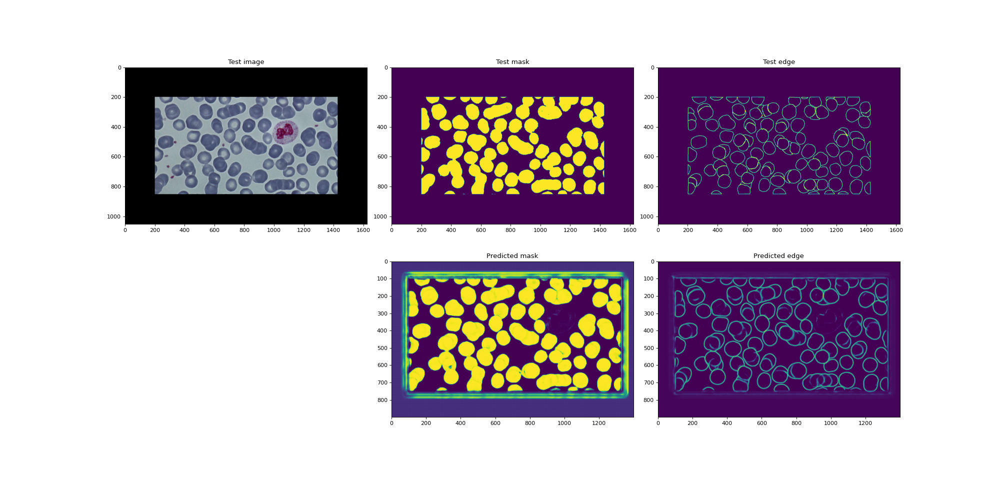

# Count Blood Cells
Count red, white blood cells to detect various diseases such as blood cancer (leukemia), lower red blood cells count (anemia)...



<!-- TABLE OF CONTENTS -->
## Table of Contents

* [Project Structure](#project-structure)
* [Install](#install)
* [Usage](#usage)
* [Develop](#develop)
* [License](#license)

## Project Structure
```
cbc/
|-- data/
|   |-- plt/...
|   |-- rbc/...
|   |-- wbc/...
|
|-- docs/...
|
|-- models/...
|
|-- output/
|   |-- plt/...
|   |-- rbc/...
|   |-- wbc/...
|
|-- AUTHORS
|-- cbc
|-- LICENSE
|-- README.md
|-- TODO.md
|-- requirements.txt 
|-- setup.py
```

## Install
- Install straight from PyPI using pip:
```
$ pip install cbc
```
## Usage
> Please read `bc-count --help` before using it
> -o flag is optional (defaults to out/ directory)
- Count blood cells (-r for red and -w for white):
```
$ cbc -r <blood-cell-image>
```
- Predict blood cell image:
```
$ cbc predict -r <blood-cell-image>
```
- Train a new model:
```
$ cbc train -r <model-name>
```

## Develop
- Download the project:
```
$ git clone https://github.com/nemo256/cbc
$ cd cbc 
```
- Activate virtual environment:
```
$ python -m venv venv
$ source venv/bin/activate
$ pip install -r requirements.txt
```
- Now just adapt the code to your need and then run using the command:
```
$ chmod +x cbc
$ ./cbc
```

## License
- Please read [cbc/LICENSE](https://github.com/nemo256/cbc/LICENSE)
